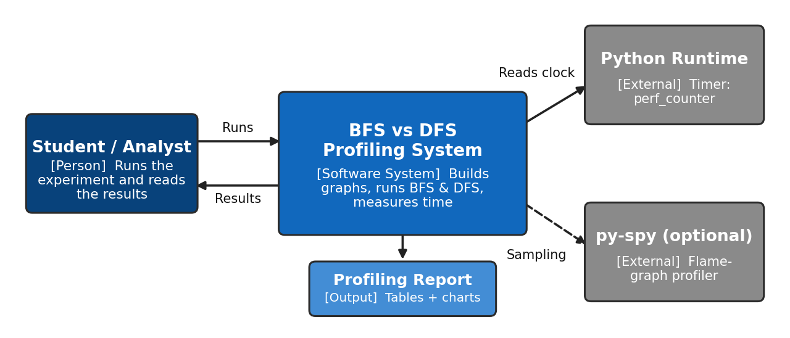
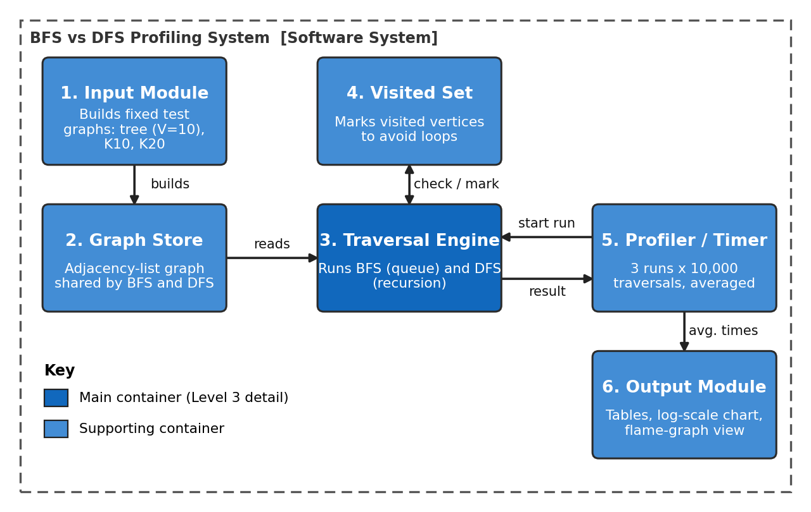
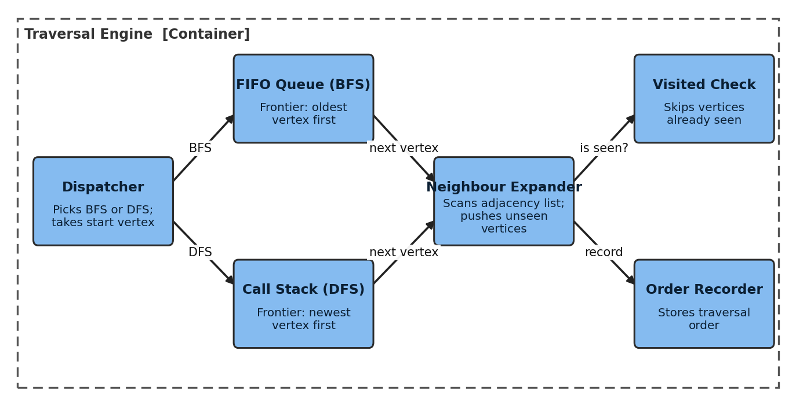

# SLE-3: Architectural Design using Full C4 Model

**Course:** 02AML204 – Introduction to Artificial Intelligence
**Programme:** SY B.Tech CSE (AI & ML), Sem-VI

> **SLE-1 = Code · SLE-2 = Performance · SLE-3 = Full Architecture Design**

## About this project

This repository holds the SLE-3 submission. It documents the architecture of the **BFS vs DFS Graph Traversal Profiling System** from SLE-2, using all four levels of the C4 model (Context → Container → Component → Code).

The system builds fixed test graphs (a 10-vertex tree, K10 and K20), runs Breadth-First Search and Depth-First Search on the same adjacency-list graph from vertex 0, times both algorithms (3 runs × 10,000 traversals each) and presents the comparison as tables and charts.

## Repository contents

| File | Description |
|---|---|
| `SLE3_25UAM111_Parshwa_Bhavare.docx` | Final SLE-3 report (3 pages) |
| `README.md` | This file |
| `AI_CONTRIBUTION_LOG.md` | Honest record of what AI helped with and what I did |
| `context_diagram.png`, `container_diagram.png`, `component_diagram.png` | The three C4 diagrams used in the report |

## C4 Model summary

### Level 1 – Context
The **Student / Analyst** uses the **BFS vs DFS Profiling System**. The system relies on the **Python runtime** (`time.perf_counter`) for timing, optionally uses **py-spy** for flame graphs, and produces a **profiling report**.

### Level 2 – Container
Six containers make up the system:

| Container | Responsibility |
|---|---|
| Input Module | Creates the deterministic test graphs (tree V=10, K10, K20) |
| Graph Store | Keeps the graph as an adjacency list shared by BFS and DFS |
| Traversal Engine | Runs BFS (FIFO queue) and DFS (recursion) from vertex 0 |
| Visited Set | Marks visited vertices so each is processed once |
| Profiler / Timer | Repeats traversals, runs 3 batches and averages the time |
| Output Module | Produces tables, a log-scale time chart and the flame-graph view |

### Level 3 – Component (Traversal Engine)
Components: **Dispatcher**, **FIFO Queue (BFS)**, **Call Stack (DFS)**, **Neighbour Expander**, **Visited Check**, **Order Recorder**.

### Level 4 – Code
| Name | Responsibility |
|---|---|
| `class Graph` | Adjacency-list graph with `add_edge(u, v)` |
| `build_tree()` / `build_complete(n)` | Create the tree, K10 and K20 test graphs |
| `bfs(graph, start)` | Queue-based traversal, returns visit order |
| `dfs(graph, start)` | Recursive traversal with a visited array, returns visit order |
| `time_traversal(fn, graph)` | Times 10,000 traversals in one batch |
| `profile_all()` | Runs 3 batches per case and algorithm, then averages |
| `make_report()` | Builds tables, chart and flame-graph view |

## Design decisions
- The system is split into small modules so graph creation, traversal, timing and reporting can change independently.
- BFS and DFS share one Graph Store and Visited Set design, which keeps the comparison fair.
- The Profiler sits outside the Traversal Engine so timing code does not mix with algorithm code.
- The Traversal Engine is detailed at Level 3 because it holds the real search logic.
- No heuristic module is shown because neither BFS nor DFS uses one.

## Related work
- **SLE-1:** Search / agent code + AI contribution log
- **SLE-2:** BFS vs DFS profiling report

## AI usage
AI assistance is documented honestly in [`AI_CONTRIBUTION_LOG.md`](AI_CONTRIBUTION_LOG.md).
